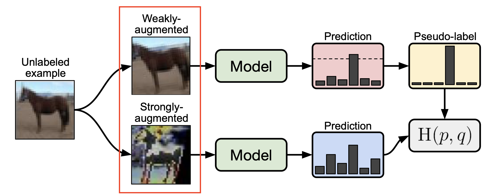
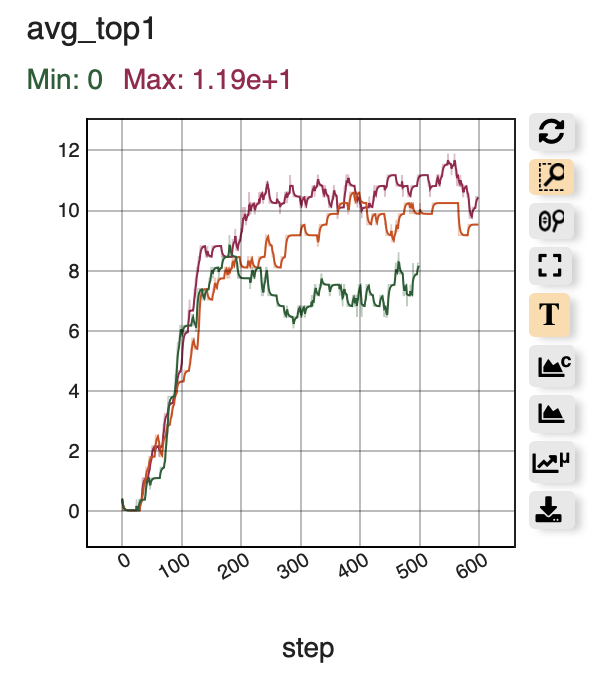
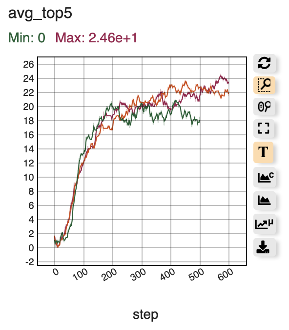
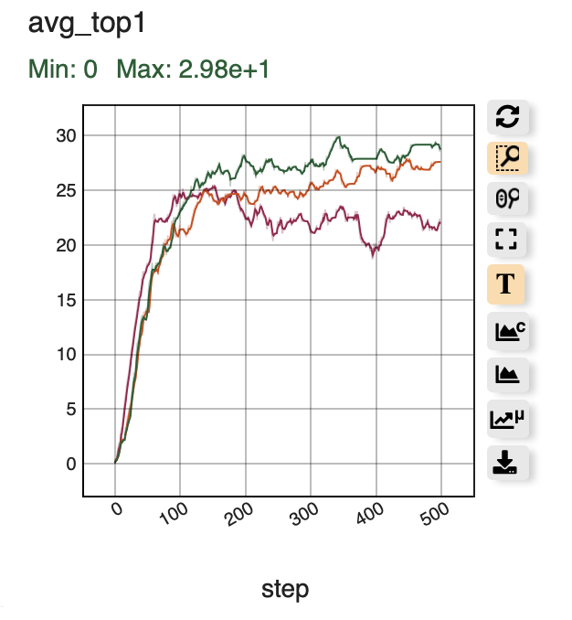
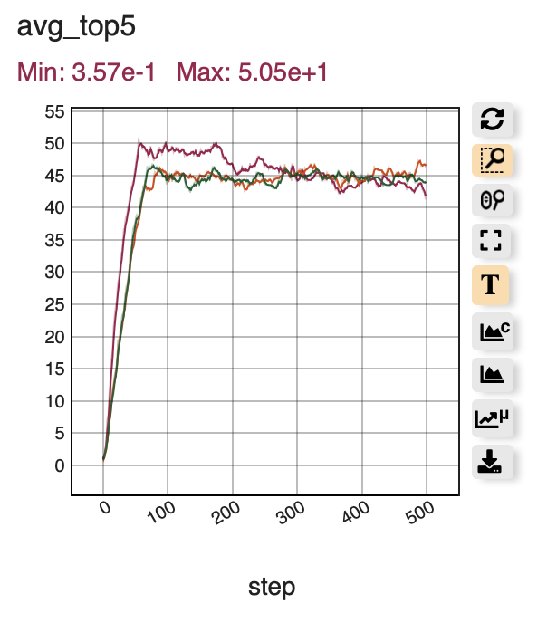

# CS492(I) CV Project

KAIST CS492(I) Special Topics in Computer Science[Deep Learning for Real-World Problems]

Authorized [DonghwanKim](https://github.com/DonghwanKIM0101)

Authorized [SeungilLee](https://github.com/ChoiIseungil)

-----------

You can also pull non-pretrained FixMixMatch model code by:

    nsml pull kaist0015/fashion_dataset/1321 .

You can also pull non-pretrained ThresholdMixMatch model code by:

    nsml pull kaist0015/fashion_dataset/1400 .

-----------

You can also pull pretrained FixMixMatch model code by:

    nsml pull kaist0015/fashion_dataset/2877 .

You can also pull pretrained ThresholdMixMatch model code by:

    nsml pull kaist0015/fashion_dataset/2878 .

# Table of contents
1. [Summary](https://github.com/DonghwanKIM0101/CS492I_CV/blob/main/README.md#summary)
2. [Method](https://github.com/DonghwanKIM0101/CS492I_CV/blob/main/README.md#method)

    2.1 [Threshold](https://github.com/DonghwanKIM0101/CS492I_CV/blob/main/README.md#threshold)

    2.2 [Data Augmentation](https://github.com/DonghwanKIM0101/CS492I_CV/blob/main/README.md#data-augmentation)

3. [Result](https://github.com/DonghwanKIM0101/CS492I_CV/blob/main/README.md#result)
4. [Conclusion](https://github.com/DonghwanKIM0101/CS492I_CV/blob/main/README.md#conclusion)

# Summary

It is project in KAIST CS492(I) course. With NSML of NAVER, implement shopping item object detection model. 

These are the example of data.
Our team's approach is to exploit [FixMatch](https://arxiv.org/pdf/2001.07685.pdf) to [MixMatch](https://arxiv.org/pdf/1905.02249.pdf).

# Method

## Threshold

Threshold is one of main concept of FixMatch.

</img> 
> https://arxiv.org/pdf/2001.07685.pdf

By using threshold while guessing pseudo label, the model only learn for confident unlabeled data.
Original method use fixed threshold value, 0.95. Compared to original method, our team have to use non-pretrained model for this project.
We suggest new concept threshold scheduling.

</img> 

In the graph, X-axis is current_epoch/total_epoch and Y-axis is the probability that unused unlabeled data.
For first epoch, the model learn the most confident 30% unlabeled data, and for last epoch, the model learn all of the unlabeled data. 

## Data Augmentation

FixMatch uses both weakly augmented data and strongly augmented data.

</img> 
> https://arxiv.org/pdf/2001.07685.pdf

For weak data augmentation, Crop, Horizontal Flip, and Vertical Flip
For strong data augmentaion, Crop, Horizontal Flip, Vertical Flip, Rotation, Color Jitter, and Cutout

# Result

To check our own model, compare MixMatch, ThresholdMixMatch, FixMixMatch.
ThresholdMixMatch is MixMatch with threshold scheduling,
FixMixMatch is MixMatch with threshold scheduling, weak and strong data augmentation.
We use DenseNet121 for all tests.

</img> 
</img> 

For non-pretrained model, ThresholdMixMatch shows the best result and FixMixMatch shows the worst result.

</img> 
</img> 

For pretrained model, three models show similar result although FixMixMatch shows the worst result in average top1.

# Conclusion

